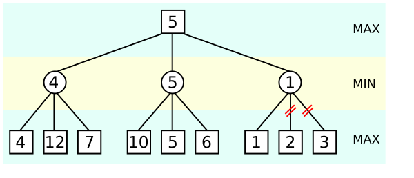

# AI_Connect4
## Abstrait

Le jeu du puissance 4 étant un jeu à somme nul, autrement dit les pertes d'un joueur sont égales aux gains de l'autre, je me suis librement inspiré de l'algorithme MinMax. 
## Algorithme Minimax et étalage alpha-beta

L'algorithme minimax visite l'arbre de jeu pour faire remonter à la racine une valeur de jeu **f(p)** qui est calculée récursivement de la façon suivante :

- **minimax(p) = f(p)** si `p` est une feuille de l'arbre où `f` est une fonction d’évaluation de la position du jeu ;
- **minimax(p) = max(minimax(O₁), …, minimax(Oₙ))** si `p` est un nœud Joueur avec fils `O₁, …, Oₙ` ;
- **minimax(p) = min(minimax(O₁), …, minimax(Oₙ))** si `p` est un nœud Opposant avec fils `O₁, …, Oₙ`.

La valeur de jeu est déterminer via l'élaboration d'une fonction heuristique évaluant le plateau et l'avantage de chacun des joueurs. La fonction heuristique implémentée dans ce code attribue un score positif lorsque l'avantage est au premier joueur et négatif pour le second joeur. 

De manière simplifiée, l'heuristque récompense les alignements de jetons d'un joueur à condition que l'autre joueur ne le bloque pas (matrice heuri). 
Par la suite on compte le nombre de menaces du joueur, c'est à dire lorsque ce dernier à 3 jetons alignés non bloqués. Si le joueur possède 2 menaces permettant de gagner au prochain tour, l'autre joueur ne peut pas bloquer les 2 au tour suivant et donc le joueur obtient une très forte récompense. De manière triviale, la récompense est maximale lorsque 4 jetons sont alignés. 

Enfin de réduire l'espace d'exploration des noeuds de l'arbre, nous utilisons l'étalage alpha-beta. Cette méthode permet d'optimiser grandement l'algorithme minimax sans en modifier le résultat. 



On peut controler les paramètre du nombre de lignes et de colonnes du jeu, ainsi que la profondeur d'exploration de l'arbre de l'IA entre 1 et 6.

## Exemple de partie : Plateau 6 × 12

```

    Qui est le 1er joueur ? 0 pour vous et 1 pour l'IA : 0
    Quel niveau de difficulté ? De 1 à 6 (5 conseillé pour le challenge, 6 temps de calcul long, de 30 à 7O secondes par coup) : 6
    -  -  -  -  -  -  -  -  -  -  -  -
    -  -  -  -  -  -  -  -  -  -  -  -
    -  -  -  -  -  -  -  -  -  -  -  -
    -  -  -  -  -  -  -  -  -  -  -  -
    -  -  -  -  -  -  -  -  -  -  -  -
    -  -  -  -  -  -  -  -  -  -  -  -
    1  2  3  4  5  6  7  8  9  10  11  12  
    
    A votre tour de jouer (entre 1 et 12): 5
    -  -  -  -  -  -  -  -  -  -  -  -
    -  -  -  -  -  -  -  -  -  -  -  -
    -  -  -  -  -  -  -  -  -  -  -  -
    -  -  -  -  -  -  -  -  -  -  -  -
    -  -  -  -  -  -  -  -  -  -  -  -
    -  -  -  -  O  -  -  -  -  -  -  -
    1  2  3  4  5  6  7  8  9  10  11  12  
    
    Calcul de l'ia ...
    14.111719846725464 secondes ; L'ia vient de jouer sur la colonne  7
    La partie est équilibré
    -  -  -  -  -  -  -  -  -  -  -  -
    -  -  -  -  -  -  -  -  -  -  -  -
    -  -  -  -  -  -  -  -  -  -  -  -
    -  -  -  -  -  -  -  -  -  -  -  -
    -  -  -  -  -  -  -  -  -  -  -  -
    -  -  -  -  O  -  X  -  -  -  -  -
    1  2  3  4  5  6  7  8  9  10  11  12  
    
    A votre tour de jouer (entre 1 et 12): 6
    -  -  -  -  -  -  -  -  -  -  -  -
    -  -  -  -  -  -  -  -  -  -  -  -
    -  -  -  -  -  -  -  -  -  -  -  -
    -  -  -  -  -  -  -  -  -  -  -  -
    -  -  -  -  -  -  -  -  -  -  -  -
    -  -  -  -  O  O  X  -  -  -  -  -
    1  2  3  4  5  6  7  8  9  10  11  12  
    
    Calcul de l'ia ...
    12.82699704170227 secondes ; L'ia vient de jouer sur la colonne  6
    La partie est équilibré
    -  -  -  -  -  -  -  -  -  -  -  -
    -  -  -  -  -  -  -  -  -  -  -  -
    -  -  -  -  -  -  -  -  -  -  -  -
    -  -  -  -  -  -  -  -  -  -  -  -
    -  -  -  -  -  X  -  -  -  -  -  -
    -  -  -  -  O  O  X  -  -  -  -  -
    1  2  3  4  5  6  7  8  9  10  11  12  
    
    A votre tour de jouer (entre 1 et 12): 6
    -  -  -  -  -  -  -  -  -  -  -  -
    -  -  -  -  -  -  -  -  -  -  -  -
    -  -  -  -  -  -  -  -  -  -  -  -
    -  -  -  -  -  O  -  -  -  -  -  -
    -  -  -  -  -  X  -  -  -  -  -  -
    -  -  -  -  O  O  X  -  -  -  -  -
    1  2  3  4  5  6  7  8  9  10  11  12  
    
    Calcul de l'ia ...
    11.836579322814941 secondes ; L'ia vient de jouer sur la colonne  7
    La partie est équilibré
    -  -  -  -  -  -  -  -  -  -  -  -
    -  -  -  -  -  -  -  -  -  -  -  -
    -  -  -  -  -  -  -  -  -  -  -  -
    -  -  -  -  -  O  -  -  -  -  -  -
    -  -  -  -  -  X  X  -  -  -  -  -
    -  -  -  -  O  O  X  -  -  -  -  -
    1  2  3  4  5  6  7  8  9  10  11  12  
    
    A votre tour de jouer (entre 1 et 12): 7
    -  -  -  -  -  -  -  -  -  -  -  -
    -  -  -  -  -  -  -  -  -  -  -  -
    -  -  -  -  -  -  -  -  -  -  -  -
    -  -  -  -  -  O  O  -  -  -  -  -
    -  -  -  -  -  X  X  -  -  -  -  -
    -  -  -  -  O  O  X  -  -  -  -  -
    1  2  3  4  5  6  7  8  9  10  11  12  
    
    Calcul de l'ia ...
    9.744004011154175 secondes ; L'ia vient de jouer sur la colonne  5
    La partie est équilibré
    -  -  -  -  -  -  -  -  -  -  -  -
    -  -  -  -  -  -  -  -  -  -  -  -
    -  -  -  -  -  -  -  -  -  -  -  -
    -  -  -  -  -  O  O  -  -  -  -  -
    -  -  -  -  X  X  X  -  -  -  -  -
    -  -  -  -  O  O  X  -  -  -  -  -
    1  2  3  4  5  6  7  8  9  10  11  12  
    
    A votre tour de jouer (entre 1 et 12): 5
    -  -  -  -  -  -  -  -  -  -  -  -
    -  -  -  -  -  -  -  -  -  -  -  -
    -  -  -  -  -  -  -  -  -  -  -  -
    -  -  -  -  O  O  O  -  -  -  -  -
    -  -  -  -  X  X  X  -  -  -  -  -
    -  -  -  -  O  O  X  -  -  -  -  -
    1  2  3  4  5  6  7  8  9  10  11  12  
    
    Calcul de l'ia ...
    7.668694496154785 secondes ; L'ia vient de jouer sur la colonne  6
    La partie est équilibré
    -  -  -  -  -  -  -  -  -  -  -  -
    -  -  -  -  -  -  -  -  -  -  -  -
    -  -  -  -  -  X  -  -  -  -  -  -
    -  -  -  -  O  O  O  -  -  -  -  -
    -  -  -  -  X  X  X  -  -  -  -  -
    -  -  -  -  O  O  X  -  -  -  -  -
    1  2  3  4  5  6  7  8  9  10  11  12  
    
    A votre tour de jouer (entre 1 et 12): 7
    -  -  -  -  -  -  -  -  -  -  -  -
    -  -  -  -  -  -  -  -  -  -  -  -
    -  -  -  -  -  X  O  -  -  -  -  -
    -  -  -  -  O  O  O  -  -  -  -  -
    -  -  -  -  X  X  X  -  -  -  -  -
    -  -  -  -  O  O  X  -  -  -  -  -
    1  2  3  4  5  6  7  8  9  10  11  12  
    
    Calcul de l'ia ...
    7.023748159408569 secondes ; L'ia vient de jouer sur la colonne  3
    L'ia a un léger avantage
    -  -  -  -  -  -  -  -  -  -  -  -
    -  -  -  -  -  -  -  -  -  -  -  -
    -  -  -  -  -  X  O  -  -  -  -  -
    -  -  -  -  O  O  O  -  -  -  -  -
    -  -  -  -  X  X  X  -  -  -  -  -
    -  -  X  -  O  O  X  -  -  -  -  -
    1  2  3  4  5  6  7  8  9  10  11  12  
    
    A votre tour de jouer (entre 1 et 12): 10
    -  -  -  -  -  -  -  -  -  -  -  -
    -  -  -  -  -  -  -  -  -  -  -  -
    -  -  -  -  -  X  O  -  -  -  -  -
    -  -  -  -  O  O  O  -  -  -  -  -
    -  -  -  -  X  X  X  -  -  -  -  -
    -  -  X  -  O  O  X  -  -  O  -  -
    1  2  3  4  5  6  7  8  9  10  11  12  
    
    Calcul de l'ia ...
    10.463969469070435 secondes ; L'ia vient de jouer sur la colonne  7
    L'ia a un léger avantage
    -  -  -  -  -  -  -  -  -  -  -  -
    -  -  -  -  -  -  X  -  -  -  -  -
    -  -  -  -  -  X  O  -  -  -  -  -
    -  -  -  -  O  O  O  -  -  -  -  -
    -  -  -  -  X  X  X  -  -  -  -  -
    -  -  X  -  O  O  X  -  -  O  -  -
    1  2  3  4  5  6  7  8  9  10  11  12  
    
    A votre tour de jouer (entre 1 et 12): 11
    -  -  -  -  -  -  -  -  -  -  -  -
    -  -  -  -  -  -  X  -  -  -  -  -
    -  -  -  -  -  X  O  -  -  -  -  -
    -  -  -  -  O  O  O  -  -  -  -  -
    -  -  -  -  X  X  X  -  -  -  -  -
    -  -  X  -  O  O  X  -  -  O  O  -
    1  2  3  4  5  6  7  8  9  10  11  12  
    
    Calcul de l'ia ...
    31.2650945186615 secondes ; L'ia vient de jouer sur la colonne  9
    La partie est équilibré
    -  -  -  -  -  -  -  -  -  -  -  -
    -  -  -  -  -  -  X  -  -  -  -  -
    -  -  -  -  -  X  O  -  -  -  -  -
    -  -  -  -  O  O  O  -  -  -  -  -
    -  -  -  -  X  X  X  -  -  -  -  -
    -  -  X  -  O  O  X  -  X  O  O  -
    1  2  3  4  5  6  7  8  9  10  11  12  
    
    A votre tour de jouer (entre 1 et 12): 9
    -  -  -  -  -  -  -  -  -  -  -  -
    -  -  -  -  -  -  X  -  -  -  -  -
    -  -  -  -  -  X  O  -  -  -  -  -
    -  -  -  -  O  O  O  -  -  -  -  -
    -  -  -  -  X  X  X  -  O  -  -  -
    -  -  X  -  O  O  X  -  X  O  O  -
    1  2  3  4  5  6  7  8  9  10  11  12  
    
    Calcul de l'ia ...
    16.78519582748413 secondes ; L'ia vient de jouer sur la colonne  1
    La partie est équilibré
    -  -  -  -  -  -  -  -  -  -  -  -
    -  -  -  -  -  -  X  -  -  -  -  -
    -  -  -  -  -  X  O  -  -  -  -  -
    -  -  -  -  O  O  O  -  -  -  -  -
    -  -  -  -  X  X  X  -  O  -  -  -
    X  -  X  -  O  O  X  -  X  O  O  -
    1  2  3  4  5  6  7  8  9  10  11  12  
    
    A votre tour de jouer (entre 1 et 12): 10
    -  -  -  -  -  -  -  -  -  -  -  -
    -  -  -  -  -  -  X  -  -  -  -  -
    -  -  -  -  -  X  O  -  -  -  -  -
    -  -  -  -  O  O  O  -  -  -  -  -
    -  -  -  -  X  X  X  -  O  O  -  -
    X  -  X  -  O  O  X  -  X  O  O  -
    1  2  3  4  5  6  7  8  9  10  11  12  
    
    Calcul de l'ia ...
    2.529480218887329 secondes ; L'ia vient de jouer sur la colonne  2
    L'ia a un énorme avantage
    -  -  -  -  -  -  -  -  -  -  -  -
    -  -  -  -  -  -  X  -  -  -  -  -
    -  -  -  -  -  X  O  -  -  -  -  -
    -  -  -  -  O  O  O  -  -  -  -  -
    -  -  -  -  X  X  X  -  O  O  -  -
    X  X  X  -  O  O  X  -  X  O  O  -
    1  2  3  4  5  6  7  8  9  10  11  12  
    
    A votre tour de jouer (entre 1 et 12): 1
    -  -  -  -  -  -  -  -  -  -  -  -
    -  -  -  -  -  -  X  -  -  -  -  -
    -  -  -  -  -  X  O  -  -  -  -  -
    -  -  -  -  O  O  O  -  -  -  -  -
    O  -  -  -  X  X  X  -  O  O  -  -
    X  X  X  -  O  O  X  -  X  O  O  -
    1  2  3  4  5  6  7  8  9  10  11  12  
    
    Calcul de l'ia ...
    0.790057897567749 secondes ; L'ia vient de jouer sur la colonne  4
    L'ia a un énorme avantage
    -  -  -  -  -  -  -  -  -  -  -  -
    -  -  -  -  -  -  X  -  -  -  -  -
    -  -  -  -  -  X  O  -  -  -  -  -
    -  -  -  -  O  O  O  -  -  -  -  -
    O  -  -  -  X  X  X  -  O  O  -  -
    X  X  X  X  O  O  X  -  X  O  O  -
    1  2  3  4  5  6  7  8  9  10  11  12  fin :  22
    


```
